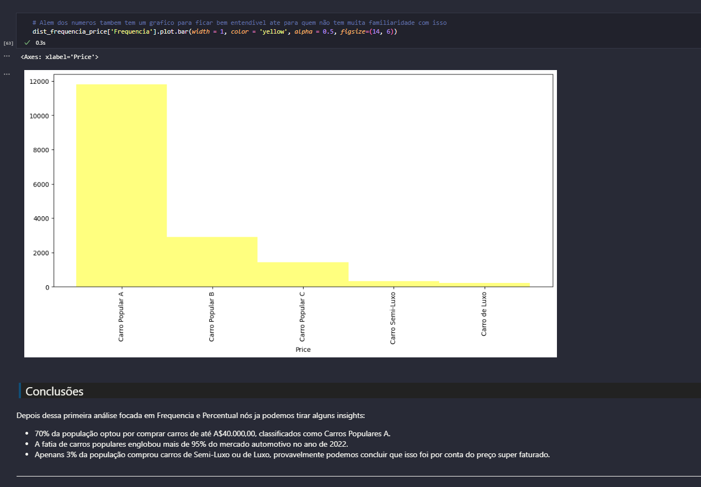
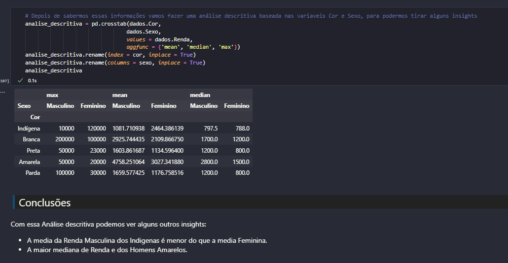

# Projeto de Estatística com Python sobre Frequências e Medidas
Projeto para fixar o conhecimento passado no curso de Estatística com Python: frequências e medidas da Alura.

  

 

  <h2>O que foi feito nesse projeto?</h2>
  Neste projeto comecei importando um Database que utilizo sobre 'Carros mais vendidos na Austrália', porem após a primeira análise percebi que ele não tinha todas as variáveis necessárias para continuar o que foi passado no curso. 
  Então nessa parte do projeto resolvi adicionar mais um Database, dessa vez sobre uma pesquisa feita com chefes de família, e terminar as análises.

   
 
  
  

    <h2>Grafico de Análise de Frequência</h2>
    Nesse grafico fiz uma Análise de Frequência baseada nos preços dos carros mais Vendidos de 2023 na Austrália, e dividindo eles em grupos como Carro Popular A, Carro Popular B, Carro Popular C, Carro Semi-Luxo e Carro de Luxo.  
    A partir disso podemos tirar alguns insights como os que estão na imagem abaixo:
    
  

 

  

    <h2>Grafico de Análise Descritiva</h2>
    Nesse grafico fiz uma Análise Descritiva cruzando os dados de Cor e Sexo para gerar insights sobre a Renda de cada pessoas, para essa análise utilizei um DataBase sobre os Chefes de Familias do Brasil em 2015.  
    A partir disso podemos tirar alguns insights como os que estão na imagem abaixo:
    
  

